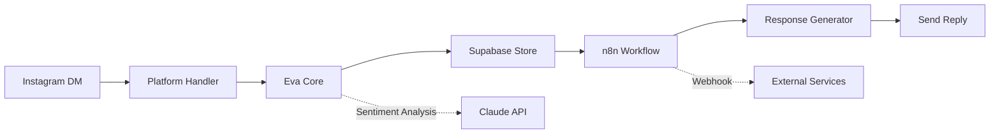

# 🔌 Wallestars Integrations Guide

**Дата**: 2026-01-02  
**Версия**: 2.0.0

---

## 📋 Съдържание

1. [GitHub Sparks Enterprise](#github-sparks-enterprise)
2. [Supabase Integration](#supabase-integration)
3. [Cline (Claude Dev) 1M Context](#cline-claude-dev)
4. [Ubuntu Pro VMs](#ubuntu-pro-vms)
5. [KeePassXC + Tails OS](#keepassxc--tails-os)
6. [PM2 Process Manager](#pm2-process-manager)
7. [Azure VM Management](#azure-vm-management)
8. [Blockchain Development](#blockchain-development)
9. [Platform Integrations](#platform-integrations)

---

## ⚡ GitHub Sparks Enterprise

### Какво е GitHub Sparks?

GitHub Sparks е Enterprise feature който предлага:
- **AI Code Generation** - Advanced code suggestions
- **Security Scanning** - Real-time vulnerability detection
- **Code Review AI** - Automated code quality checks
- **Analytics** - Advanced repository insights
- **CI/CD Enhancements** - Enterprise GitHub Actions

### Setup

```bash
# Authenticate with GitHub
gh auth login

# Setup Sparks
bash /workspaces/Wallestars/.devcontainer/helpers/github-sparks-setup.sh

# Verify
sparks status
```

### Available Commands

```bash
# Check Sparks status
sparks status

# View repository analytics
sparks analytics

# AI code review for PR
sparks ai-review 35

# Security scan
sparks security
```

### Configuration

Edit: `/workspace/.sparks/config.yml`

```yaml
features:
  ai_assistant: true
  copilot_enterprise: true
  insights: true
  security_scanning: true

integrations:
  - name: eva-core
    type: ai-workflow
    enabled: true
  - name: n8n-automation
    type: workflow
    enabled: true
```

### Enterprise Features

#### 1. AI-Powered Code Review

Всеки PR автоматично получава:
- Code quality suggestions
- Security vulnerability detection
- Performance optimization hints
- Best practices recommendations

#### 2. Advanced Analytics

```bash
# View detailed metrics
sparks analytics

# Включва:
# - Contributor activity
# - Code churn analysis
# - Deployment frequency
# - Mean time to recovery
```

#### 3. Security Scanning

- Real-time dependency scanning
- Secret detection
- Code vulnerability analysis
- License compliance check

---

## 🗄️  Supabase Integration

### Overview

Supabase е open-source Firebase alternative с:
- **PostgreSQL Database** - Full SQL support
- **Realtime** - WebSocket subscriptions
- **Authentication** - Built-in auth system
- **Storage** - File storage S3-compatible
- **Edge Functions** - Serverless functions

### Setup

```bash
# Initialize Supabase
bash /workspaces/Wallestars/.devcontainer/helpers/supabase-integration.sh

# Start local instance
supa start

# Open Studio
supa studio
```

### Database Schema

Located in: `.supabase/migrations/`

**Schema includes:**
- `eva` schema - Eva Core tables
- `workflows` schema - n8n workflow executions
- `platforms` schema - Platform integrations
- `analytics` schema - Event tracking

### TypeScript Types

```bash
# Generate types from database
supa types

# Types saved to: .supabase/types/database.types.ts
```

### Usage in Eva Core

```javascript
import { createClient } from '@supabase/supabase-js'
import { Database } from './.supabase/types/database.types'

const supabase = createClient<Database>(
  process.env.SUPABASE_URL,
  process.env.SUPABASE_KEY
)

// Save Eva interaction
await supabase.from('eva.interactions').insert({
  user_id: userId,
  platform: 'instagram',
  type: 'direct_message',
  content: message,
  sentiment: 'positive',
  priority: 8
})

// Subscribe to realtime changes
supabase
  .channel('eva-interactions')
  .on('postgres_changes', {
    event: 'INSERT',
    schema: 'eva',
    table: 'interactions'
  }, (payload) => {
    console.log('New interaction:', payload.new)
  })
  .subscribe()
```

### Edge Functions

Located in: `.supabase/functions/`

Example - Eva Webhook:

```bash
# Deploy function
supabase functions deploy eva-webhook

# Test locally
supabase functions serve eva-webhook
```

### Available Commands

```bash
supa start    # Start local Supabase
supa stop     # Stop Supabase
supa reset    # Reset database
supa migrate  # Run migrations
supa types    # Generate TypeScript types
supa studio   # Open Supabase Studio
```

### Realtime Features

```javascript
// Subscribe to Eva actions
const channel = supabase.channel('eva-actions')
  .on('postgres_changes', {
    event: '*',
    schema: 'eva',
    table: 'actions'
  }, (payload) => {
    console.log('Action update:', payload)
  })
  .subscribe()
```

---

## 🤖 Cline (Claude Dev) - 1M Context

### What is Cline?

Cline (formerly Claude Dev) е AI assistant с:
- **1M tokens context window** - Massive context awareness
- **Full codebase understanding** - Can analyze entire project
- **Multi-file editing** - Edit multiple files at once
- **Terminal access** - Can run commands
- **Browser automation** - Can interact with web apps

### Configuration

В `.devcontainer/devcontainer.json`:

```json
{
  "customizations": {
    "vscode": {
      "settings": {
        "claude-dev.apiKey": "${ANTHROPIC_API_KEY}",
        "claude-dev.model": "claude-sonnet-4-20250514",
        "claude-dev.maxTokens": 1000000,
        "claude-dev.temperature": 0.7
      }
    }
  }
}
```

### Environment Variables

```bash
# Add to .env
ANTHROPIC_API_KEY=sk-ant-your-key-here
```

### Best Practices

#### 1. Full Context Mode

Cline може да анализира целия проект:

```
@workspace Analyze the entire Wallestars codebase and suggest improvements
```

#### 2. Multi-Platform Development

```
Create Instagram integration in platforms/instagram/ following the pattern from telegram-messages/
```

#### 3. Complex Workflows

```
Implement end-to-end workflow: 
1. Receive Instagram DM
2. Process with Eva Core
3. Store in Supabase
4. Trigger n8n workflow
5. Send response
```

#### 4. Refactoring

```
Refactor eva-core to use Supabase instead of in-memory storage
```

### Permissions

Cline може да:
- ✅ Read entire codebase
- ✅ Edit multiple files
- ✅ Run terminal commands
- ✅ Install packages
- ✅ Access browser (with permission)
- ⚠️  Cannot commit to git (requires confirmation)

### Task Examples

**Eva Core Enhancement:**
```
Enhance Eva Core with:
1. Supabase integration for persistence
2. Better sentiment analysis using Claude API
3. Add conversation history tracking
4. Implement scheduled actions queue
```

**Platform Integration:**
```
Create new platform integration for WhatsApp:
1. Follow platforms/telegram-messages structure
2. Add WhatsApp API client
3. Implement message handlers
4. Connect to Eva Core
5. Add tests
```

**n8n Workflow:**
```
Create n8n workflow:
1. Webhook receives Instagram comment
2. Eva Core processes sentiment
3. If negative - escalate to human
4. If positive - auto-reply
5. Log to Supabase
```

---

## ☁️  Ubuntu Pro VMs

### Overview

You have:
- **5 free VMs** with Ubuntu Pro (базов план)
- **10 bonus VMs** (допълнителни)
- **Total: 15 VMs** available

### Ubuntu Pro Benefits

- **Extended Security Maintenance (ESM)** - 10 years security updates
- **Kernel Livepatch** - Security patches без restart
- **FIPS & CC-EAL compliance** - За regulated industries
- **24/7 Support** - Enterprise support

### VM Templates

Wallestars предефинирани VMs:

1. **wallestars-n8n** - n8n Workflow Server
2. **wallestars-eva** - Eva Core Processing
3. **wallestars-db** - Database Server
4. **wallestars-supabase** - Supabase Instance
5. **wallestars-platforms** - Platform Services
6-10. **wallestars-worker-X** - Worker Nodes
11-15. **wallestars-dev-X** - Development Environments

### Setup

```bash
# Initialize VM templates
vm-manager init

# List available VMs
vm-manager list
vms

# Launch VM
vm-manager launch wallestars-n8n

# Shell into VM
vm-manager shell wallestars-n8n
vm-shell wallestars-n8n

# Stop VM
vm-manager stop wallestars-n8n

# Delete VM
vm-manager delete wallestars-n8n

# Ubuntu Pro info
vm-manager pro
```

### Architecture Example

```
┌─────────────────────────────────────────┐
│         Development Machine             │
│         (Main Codespace)                │
└─────────────────┬───────────────────────┘
                  │
     ┌────────────┼────────────┐
     │            │            │
     ▼            ▼            ▼
┌──────────┐ ┌──────────┐ ┌──────────┐
│ n8n VM   │ │ Eva VM   │ │  DB VM   │
│ (5678)   │ │ (3000)   │ │ (5432)   │
└──────────┘ └──────────┘ └──────────┘
     │            │            │
     └────────────┼────────────┘
                  ▼
         ┌────────────────┐
         │  Supabase VM   │
         │    (54321)     │
         └────────────────┘
```

### Production Deployment

```bash
# 1. Launch production VMs
vm-launch wallestars-n8n
vm-launch wallestars-eva
vm-launch wallestars-db
vm-launch wallestars-supabase

# 2. Attach Ubuntu Pro
vm-shell wallestars-n8n
sudo pro attach YOUR-TOKEN

# 3. Deploy services
# (inside VM)
git clone https://github.com/Wallesters-org/Wallestars.git
cd Wallestars
npm install
docker-compose up -d

# 4. Configure networking
# Setup reverse proxy, SSL, etc.
```

### Multi-VM Orchestration

```bash
# Create deployment script
cat > deploy-to-vms.sh << 'EOF'
#!/bin/bash

VMS=("wallestars-n8n" "wallestars-eva" "wallestars-db")

for vm in "${VMS[@]}"; do
    echo "Deploying to $vm..."
    multipass exec $vm -- bash -c "
        cd /home/ubuntu/Wallestars
        git pull
        docker-compose up -d --build
    "
done
EOF

chmod +x deploy-to-vms.sh
./deploy-to-vms.sh
```

---

## 🔐 KeePassXC + Tails OS

### Architecture

```
Tails OS (USB-C) → KeePassXC → Dev Container
     ↓                 ↓            ↓
Persistent       Encrypted     Read-only
 Storage          Database       Mount
```

### Setup

Пълна документация: [SECRETS-MANAGEMENT.md](./SECRETS-MANAGEMENT.md)

### Quick Commands

```bash
# Sync credentials from KeePassXC
keepass-sync

# Load into environment
load-secrets

# Security audit
secrets-audit

# Check status
keepass-status
```

---

## 🔗 Platform Integrations

### Available Platforms

```bash
# List all platforms
platform-manager list

# Setup specific platform
platform-manager setup telegram-messages

# Test platform
platform-manager test telegram-messages
```

### Platform Structure

```
platforms/
├── telegram-messages/
├── instagram/
├── facebook/
├── twitter/
├── whatsapp/
├── youtube/
└── linkedin/
```

### Create New Platform

```bash
# Using Cline
@cline Create new platform integration for TikTok following the existing pattern
```

---

## 📊 Integration Matrix

| Integration | Status | Auto-Setup | Manual Config |
|------------|--------|------------|---------------|
| **GitHub Sparks** | ✅ | Yes | GitHub auth required |
| **Supabase** | ✅ | Yes | API keys needed |
| **Cline** | ✅ | Yes | Anthropic API key |
| **Ubuntu VMs** | ✅ | Yes | Multipass needed |
| **KeePassXC** | ✅ | Manual | USB mount |
| **PM2** | ✅ | Yes | Pre-installed |
| **Azure VMs** | ✅ | Yes | az CLI + token |
| **Blockchain** | ✅ | Yes | Extensions ready |
| **n8n** | ✅ | Yes | Auto-start |
| **Eva Core** | ✅ | Yes | Config template |
| **PostgreSQL** | ✅ | Yes | Auto-start |
| **Redis** | ✅ | Yes | Auto-start |

---

## 📦 PM2 Process Manager

### Какво е PM2?

PM2 е production process manager за Node.js applications:
- **Process Management** - Start, stop, restart processes
- **Load Balancing** - Cluster mode
- **Auto Restart** - On crashes or file changes
- **Monitoring** - Real-time dashboard
- **Log Management** - Centralized logs

### Usage

```bash
# Start n8n with PM2
pm2-n8n

# List all processes
pm2-list

# View logs
pm2-logs

# Stop all
pm2-stop-all

# Restart all
pm2-restart-all

# Advanced: Start custom process
pm2 start "node server.js" --name my-app

# Monitor
pm2 monit

# Save process list
pm2 save

# Setup auto-start on reboot
pm2 startup
```

### n8n with PM2

```bash
# Start n8n in background
pm2 start n8n --name wallestars-n8n -- start

# View logs
pm2 logs wallestars-n8n

# Restart
pm2 restart wallestars-n8n

# Stop
pm2 stop wallestars-n8n

# Delete
pm2 delete wallestars-n8n
```

### Benefits

- ✅ n8n runs in background, container stays alive
- ✅ Auto-restart if n8n crashes
- ✅ Better log management
- ✅ Multiple processes support
- ✅ Zero-downtime reload

---

## ☁️ Azure VM Management

### 15 Ubuntu Pro VMs Available

**Your Account:**
- 5 free VMs (Ubuntu Pro personal)
- 10 bonus VMs

**Pre-installed Commands:**

```bash
# List all VMs
azure-vm-list

# Start VM
azure-vm-start <vm-name> <resource-group>
# Example: azure-vm-start wallestars-n8n my-resource-group

# Stop VM
azure-vm-stop <vm-name> <resource-group>

# Check status
azure-vm-status <vm-name> <resource-group>

# Advanced: Create new VM
az vm create \
    --resource-group my-rg \
    --name wallestars-vm \
    --image UbuntuLTS \
    --admin-username azureuser \
    --generate-ssh-keys \
    --size Standard_B2s

# SSH into VM
ssh azureuser@<vm-ip-address>

# Deploy n8n to VM
scp -r /workspaces/Wallestars/workflows/ azureuser@<vm-ip>:~/
ssh azureuser@<vm-ip>
cd workflows
docker-compose up -d
```

### Recommended VM Setup

**For n8n Server:**
- Size: Standard_B2s (2 vCPUs, 4GB RAM)
- OS: Ubuntu Pro 22.04 LTS
- Disk: 30GB SSD

**For Eva Processing:**
- Size: Standard_B4ms (4 vCPUs, 16GB RAM)
- OS: Ubuntu Pro 22.04 LTS
- Disk: 50GB SSD

**For Database:**
- Size: Standard_D2s_v3 (2 vCPUs, 8GB RAM)
- OS: Ubuntu Pro 22.04 LTS
- Disk: 100GB Premium SSD

### Benefits of Ubuntu Pro

- ✅ Extended Security Maintenance (ESM)
- ✅ Kernel Livepatch (no reboot for patches)
- ✅ FIPS compliance available
- ✅ 24/7 Enterprise support
- ✅ 10 years of support

---

## ⛓️ Blockchain Development

### Supported Blockchains

1. **Ethereum** - Hardhat, Solidity
2. **Solana** - Anchor, Rust
3. **Polygon** - EVM compatible
4. **BSC** - Binance Smart Chain

### Pre-installed Extensions

```
- juanblanco.solidity - Solidity language support
- tintinweb.solidity-visual-auditor - Security auditor
- nomicfoundation.hardhat-solidity - Hardhat integration
```

### Quick Start: Ethereum

```bash
# Create Hardhat project
mkdir -p /workspaces/Wallestars/blockchain/ethereum
cd /workspaces/Wallestars/blockchain/ethereum

# Initialize Hardhat
npx hardhat init

# Install dependencies
npm install @openzeppelin/contracts

# Create smart contract
cat > contracts/WallestarsNFT.sol << 'EOF'
// SPDX-License-Identifier: MIT
pragma solidity ^0.8.20;

import "@openzeppelin/contracts/token/ERC721/ERC721.sol";
import "@openzeppelin/contracts/access/Ownable.sol";

contract WallestarsNFT is ERC721, Ownable {
    uint256 private _tokenIdCounter;

    constructor() ERC721("Wallestars", "WSTR") Ownable(msg.sender) {}

    function safeMint(address to) public onlyOwner {
        uint256 tokenId = _tokenIdCounter;
        _tokenIdCounter++;
        _safeMint(to, tokenId);
    }
}
EOF

# Compile
npx hardhat compile

# Test local network
npx hardhat node

# Deploy (in another terminal)
npx hardhat run scripts/deploy.js --network localhost
```

### DJ Workflow Integration

Вашият `dj-workflow-multichain.json` вече съдържа:
- Ethereum (RPC: https://eth-mainnet.alchemyapi.io/v2/...)
- Polygon (RPC: https://polygon-rpc.com)
- Solana (RPC: https://api.mainnet-beta.solana.com)
- BSC (RPC: https://bsc-dataseed.binance.org/)

```bash
# Test blockchain connections
cd /workspaces/Wallestars/workflows
node test-blockchain-rpcs.js
```

### Security Best Practices

1. ✅ Never commit private keys
2. ✅ Use environment variables for RPC URLs
3. ✅ Test on testnets first (Goerli, Mumbai, Devnet)
4. ✅ Audit contracts with security tools
5. ✅ Use OpenZeppelin libraries

---

## 🚀 Complete Workflow Example

### Instagram → Eva → Supabase → n8n → Response



**Implementation:**

1. **Instagram Handler** (platforms/instagram/)
2. **Eva Processing** (eva-core/)
3. **Supabase Storage** (.supabase/)
4. **n8n Automation** (workflows/)
5. **Response via API**

---

## 📚 Additional Resources

- [GitHub Sparks Docs](https://docs.github.com/enterprise)
- [Supabase Docs](https://supabase.io/docs)
- [Anthropic Claude](https://docs.anthropic.com/)
- [Ubuntu Pro](https://ubuntu.com/pro)
- [Multipass](https://multipass.run/)
- [KeePassXC](https://keepassxc.org/)
- [PM2 Documentation](https://pm2.keymetrics.io/)
- [Azure CLI](https://docs.microsoft.com/cli/azure/)
- [Hardhat](https://hardhat.org/)
- [Solidity](https://docs.soliditylang.org/)

---

**Автор**: Wallestars Team  
**Версия**: 2.1.0 (Enhanced with Cloud Agent improvements)  
**Дата**: 2026-01-02  
**Последна актуализация**: 2026-01-02  
**Версия**: 2.0.0
