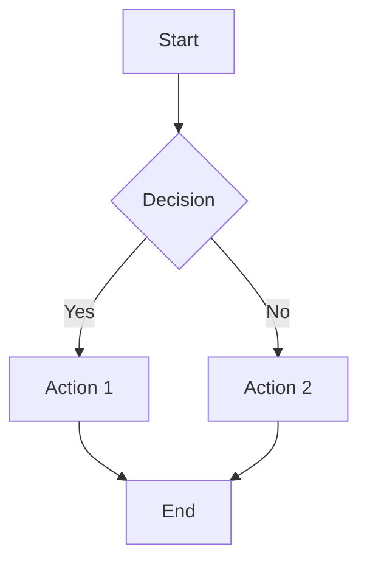

# Примери за Използване на Агента

Тази директория съдържа примерни файлове, които демонстрират как работи агентът за анализ и съставяне на задачи.

## 📂 Структура на Примерите

```
examples/
├── tasks/                              # Примерни task файлове
│   ├── T000_orchestrator_init.md      # Начален оркестратор
│   └── T001_input_analysis.md         # Задача за анализ на входа
│
├── analysis/                           # Примерни анализни файлове
│   └── example_input_analysis.md      # Детайлен анализ
│
└── planning/                           # Примерни planning файлове
    └── communication_diagram.md        # Визуална схема на комуникацията
```

## 🎯 Как да Използвате Примерите

### 1. Преглед на Task Файлове

Файловете в `tasks/` показват структурата на типична задача:
- **T000_orchestrator_init.md** - Първата задача, която инициализира всичко
- **T001_input_analysis.md** - Задача за анализ на входни данни

**Ключови секции в task файл:**
- 📋 Метаданни (ID, приоритет, статус, зависимости)
- 🎯 Цел на задачата
- 📝 Подробно описание
- 🔗 Контекст и връзки
- 💡 Промпт инструкции за LLM
- ✅ Условия за завършване
- 🔍 Критерии за валидиране
- 📊 Изходни файлове
- 🔄 Синхронизация с други задачи

### 2. Разглеждане на Анализни Файлове

Файлът `analysis/example_input_analysis.md` показва:
- Как се анализират входните данни
- Как се извличат ключови концепции
- Как се структурират изисквания
- Как се подготвя информация за следващи стъпки

### 3. Разбиране на Комуникационната Схема

Файлът `planning/communication_diagram.md` съдържа:
- Mermaid диаграми на архитектурата
- ASCII визуализации на потока
- Описание на синхронизацията
- Роли на различните компоненти

## 🚀 Бързо Начало

### Стъпка 1: Прочетете Главния Конфигурационен Файл

Първо прочетете `../my-agent.md` за пълно разбиране на агента.

### Стъпка 2: Разгледайте Примерните Task Файлове

```bash
# Отворете в текстов редактор
cat examples/tasks/T000_orchestrator_init.md
cat examples/tasks/T001_input_analysis.md
```

Обърнете внимание на:
- Структурата на метаданните
- Как са дефинирани зависимостите
- Промпт инструкциите за LLM
- Синхронизационните механизми

### Стъпка 3: Проучете Примерния Анализ

```bash
cat examples/analysis/example_input_analysis.md
```

Забележете:
- Как се структурира информацията
- Какво се извлича от входните данни
- Как се представят изискванията
- Как се подготвя информация за следващи tasks

### Стъпка 4: Разберете Комуникацията

```bash
cat examples/planning/communication_diagram.md
```

Изучете:
- Визуалните схеми (Mermaid + ASCII)
- Потока на данни
- Синхронизационните механизми
- Ролите на компонентите

## 📝 Създаване на Собствени Tasks

Използвайте примерните файлове като шаблон:

### Шаблон за Нова Задача

```markdown
# Task T[XXX]: [Заглавие]

## 📋 Метаданни
- **Task ID:** T[XXX]
- **Приоритет:** [Висок/Среден/Нисък]
- **Статус:** [Pending/In Progress/Completed/Blocked]
- **Създадена:** [Timestamp]
- **Зависимости:** [List of task IDs]
- **Изисквано време:** [Estimate]

## 🎯 Цел на задачата
[Ясно описание на целта]

## 📝 Подробно описание
[Детайлна информация]

## 🔗 Контекст и връзки
### Предходни задачи:
[List с връзки]

### Следващи задачи:
[List с връзки]

## 💡 Инструкции за изпълнение (Промпт за LLM)
```
[Детайлен промпт]
```

## ✅ Условия за завършване
- [ ] [Condition 1]
- [ ] [Condition 2]

## 🔍 Критерии за валидиране
[Validation criteria]

## 📊 Изходни файлове
[Expected outputs]

## 🔄 Статус на други задачи (Синхронизация)
[Task chain visualization]
```

## 🎨 Примерни Сценарии

### Сценарий 1: Анализ на AI Чат

**Вход:**
- Claude conversation URL за feature discussion

**Процес:**
1. T000 създава environment
2. T001 анализира чата
3. T002 създава implementation plan
4. T003+ изпълняват специфичните задачи

**Изход:**
- Структуриран plan с tasks
- Всеки task с детайлни инструкции

### Сценарий 2: GitHub Issue Resolution

**Вход:**
- GitHub Issue URL с bug report

**Процес:**
1. Анализ на issue
2. Root cause analysis
3. Fix plan creation
4. Test strategy
5. Implementation tasks

**Изход:**
- Готови за изпълнение tasks
- Test plan
- Validation criteria

## 💡 Best Practices

### При Създаване на Tasks:

1. **Бъдете Конкретни**
   - Ясна и измерима цел
   - Конкретни критерии за успех
   - Недвусмислени инструкции

2. **Поддържайте Контекст**
   - Включете релевантна информация
   - Link-вайте към предходни tasks
   - Споделяйте глобален контекст

3. **Дефинирайте Зависимости**
   - Ясно посочете prerequisites
   - Определете блокиращи задачи
   - Опишете последователността

4. **Създавайте Валидируеми Резултати**
   - Measurable outcomes
   - Testable criteria
   - Documentable results

### При Анализ на Входни Данни:

1. **Бъдете Изчерпателни**
   - Не пропускайте източници
   - Документирайте всички находки
   - Capture всички requirements

2. **Структурирайте Информацията**
   - Използвайте consistent formatting
   - Организирайте логично
   - Create machine-readable outputs

3. **Мислете Напред**
   - Предвиждайте нужди на следващи tasks
   - Подгответе полезна информация
   - Идентифицирайте потенциални проблеми

## 🔧 Технически Насоки

### Форматиране на Файлове:

**Markdown:**
```markdown
# Heading 1
## Heading 2
### Heading 3

- Bullet point
- Another point

**Bold text**
*Italic text*
`Code inline`

```code block```
```

**YAML:**
```yaml
key: value
list:
  - item1
  - item2
nested:
  key: value
```

**JSON:**
```json
{
  "key": "value",
  "array": [1, 2, 3],
  "nested": {
    "key": "value"
  }
}
```

### Mermaid Diagrams:

```markdown

```

## 📚 Допълнителни Ресурси

- **Главна документация:** `../my-agent.md`
- **Mermaid syntax:** https://mermaid.js.org/
- **Markdown guide:** https://www.markdownguide.org/
- **YAML tutorial:** https://yaml.org/spec/

## ❓ Често Задавани Въпроси

### Как да стартирам агента?

Извикайте агента чрез:
```
@copilot използвай агента my-agent за анализ на [входни данни]
```

### Как да създам custom task?

Копирайте някой от примерните task файлове и го модифицирайте според вашите нужди.

### Може ли да променя структурата?

Да, но препоръчваме да запазите основните секции за consistency.

### Как tasks комуникират помежду си?

Чрез споделени файлове в `context/` директорията и sequential passing на outputs.

---

**За въпроси или подобрения, отворете issue в GitHub repository.**
