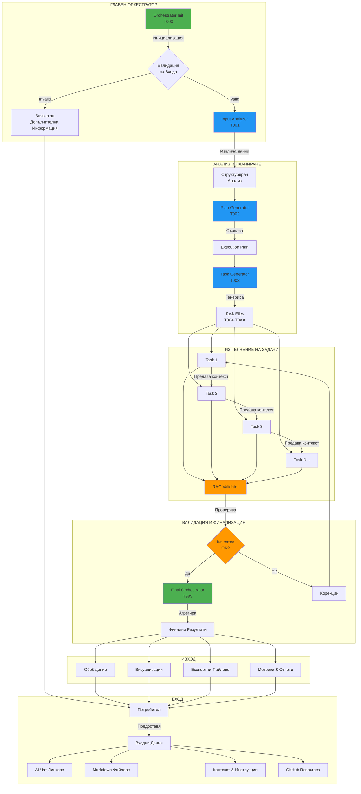

# Комуникационна Диаграма и Архитектура

## 🎨 Визуална Схема на Системата

### Главна Архитектура (Mermaid Diagram)



---

## 🔄 Поток на Комуникация (Детайлен)

### ASCII Диаграма

```
┌──────────────────────────────────────────────────────────────────────┐
│                        ПОТРЕБИТЕЛ / USER INPUT                        │
└────────────────────────────┬─────────────────────────────────────────┘
                             │
                             ▼
┌──────────────────────────────────────────────────────────────────────┐
│  📥 НАЧАЛЕН ОРКЕСТРАТОР (T000)                                       │
│  • Приема входни данни                                               │
│  • Валидира source качеството                                        │
│  • Създава работна environment                                       │
│  • Инициализира global context                                       │
└────────────────────────────┬─────────────────────────────────────────┘
                             │
                             │ Signals: "Environment Ready"
                             ▼
┌──────────────────────────────────────────────────────────────────────┐
│  🔍 АНАЛИЗАТОР (T001)                                                │
│  • Извлича информация от източници                                   │
│  • Парсва и структурира данни                                        │
│  • Идентифицира ключови концепции                                    │
│  • Генерира analysis files                                           │
└────────────────────────────┬─────────────────────────────────────────┘
                             │
                             │ Outputs: analysis/*.md, *.json, *.yaml
                             ▼
┌──────────────────────────────────────────────────────────────────────┐
│  📋 ГЕНЕРАТОР НА ПЛАН (T002)                                         │
│  • Чете анализа от T001                                              │
│  • Създава execution roadmap                                         │
│  • Определя фази и milestones                                        │
│  • Дефинира dependencies                                             │
└────────────────────────────┬─────────────────────────────────────────┘
                             │
                             │ Outputs: planning/execution_plan.md
                             ▼
┌──────────────────────────────────────────────────────────────────────┐
│  🎯 ГЕНЕРАТОР НА ЗАДАЧИ (T003)                                       │
│  • Чете execution plan от T002                                       │
│  • Breakdown на задачи                                               │
│  • Създава task файлове (T004, T005, ...)                           │
│  • Дефинира синхронизация                                            │
└────────────────────────────┬─────────────────────────────────────────┘
                             │
                             │ Outputs: tasks/T004.md, T005.md, ...
                             ▼
┌──────────────────────────────────────────────────────────────────────┐
│                    ИЗПЪЛНИТЕЛНИ ЗАДАЧИ                               │
│                                                                      │
│  ┌─────────────┐      ┌─────────────┐      ┌─────────────┐         │
│  │   TASK 1    │ ───► │   TASK 2    │ ───► │   TASK 3    │  ...    │
│  │   (T004)    │      │   (T005)    │      │   (T006)    │         │
│  └──────┬──────┘      └──────┬──────┘      └──────┬──────┘         │
│         │                    │                    │                 │
│         │   Context Flow     │   Context Flow     │                 │
│         │   (Sequential)     │   (Sequential)     │                 │
│         └────────────────────┴────────────────────┘                 │
│                              │                                      │
│                 Continuous Updates to Session State                │
└──────────────────────────────┬───────────────────────────────────────┘
                               │
                               │ Outputs: results/task_outputs/*
                               ▼
┌──────────────────────────────────────────────────────────────────────┐
│  ✅ ВАЛИДАТОР (Continuous)                                           │
│  • Проверява output quality                                          │
│  • RAG-базирано scoring                                             │
│  • Идентифицира gaps                                                 │
│  • Trigger корекции при нужда                                        │
└────────────────────────────┬─────────────────────────────────────────┘
                             │
                             │ Validation Reports
                             ▼
┌──────────────────────────────────────────────────────────────────────┐
│  📊 ФИНАЛЕН ОРКЕСТРАТОР (T999)                                       │
│  • Агрегира резултати от всички tasks                                │
│  • Генерира comprehensive summary                                    │
│  • Създава визуализации                                              │
│  • Експортира финални deliverables                                   │
└────────────────────────────┬─────────────────────────────────────────┘
                             │
                             │ Final Outputs
                             ▼
┌──────────────────────────────────────────────────────────────────────┐
│                      📤 ИЗХОДНИ ДАННИ                                │
│  • Summary & Reports                                                 │
│  • Визуални Схеми                                                    │
│  • Експортни Файлове                                                 │
│  • Метрики & Analytics                                               │
└────────────────────────────┬─────────────────────────────────────────┘
                             │
                             ▼
                        ПОТРЕБИТЕЛ
```

---

## 🔗 Синхронизация между Задачите

### Модел на Комуникация

```
Задача N
   │
   ├─ Чете: context/global_context.yaml (споделен контекст)
   ├─ Чете: context/session_state.json (статус на други tasks)
   ├─ Чете: results/task_outputs/T{N-1}_output.md (предишна задача)
   │
   ├─ ОБРАБОТВА
   │
   ├─ Записва: results/task_outputs/T{N}_output.md (собствен output)
   ├─ Актуализира: context/session_state.json (обновява статус)
   ├─ Сигнализира: Задача N+1 (next task)
   │
   └─ ЗАВЪРШВА
```

### Пример за Синхронизация

```yaml
# context/session_state.json (в момент T)

{
  "current_time": "2026-01-03T10:30:00Z",
  "active_task": "T005",
  
  "tasks": {
    "T000": { "status": "completed", "completion_time": "10:05:00Z" },
    "T001": { "status": "completed", "completion_time": "10:10:00Z" },
    "T002": { "status": "completed", "completion_time": "10:15:00Z" },
    "T003": { "status": "completed", "completion_time": "10:20:00Z" },
    "T004": { "status": "completed", "completion_time": "10:25:00Z" },
    "T005": { "status": "in_progress", "started": "10:26:00Z" },
    "T006": { "status": "pending", "blocked_by": ["T005"] },
    "T007": { "status": "pending", "blocked_by": ["T005", "T006"] }
  },
  
  "context_shared": {
    "project_name": "JWT Auth Implementation",
    "main_goal": "Production-ready authentication system",
    "technology_stack": ["Node.js", "Express", "JWT", "bcrypt"]
  },
  
  "outputs_available": {
    "T001": ["analysis/input_analysis.md", "analysis/key_concepts.json"],
    "T002": ["planning/execution_plan.md"],
    "T003": ["tasks/T004.md", "tasks/T005.md", "tasks/T006.md"],
    "T004": ["results/task_outputs/T004_output.md"]
  }
}
```

---

## 🎭 Роли в Системата

### 1. Оркестратори (Coordinators)

#### Начален Оркестратор (T000)
```
Роля: Bootstrap & Setup
─────────────────────────
• Създава работна среда
• Инициализира контекст
• Валидира входни данни
• Starter за execution chain
```

#### Финален Оркестратор (T999)
```
Роля: Aggregation & Finalization
─────────────────────────────────
• Събира резултати
• Генерира summary
• Създава визуализации
• Експортира deliverables
```

### 2. Процесори (Processors)

#### Анализатор (T001)
```
Роля: Information Extraction
────────────────────────────
• Parse входни данни
• Extract key concepts
• Structure information
• Generate analysis files
```

#### Генератор на План (T002)
```
Роля: Planning & Roadmap
────────────────────────
• Create execution plan
• Define milestones
• Identify dependencies
• Estimate effort
```

#### Генератор на Задачи (T003)
```
Роля: Task Breakdown
────────────────────
• Decompose plan
• Create task files
• Define sync mechanism
• Set priorities
```

### 3. Изпълнители (Executors)

#### Task N (T004+)
```
Роля: Specific Work Execution
─────────────────────────────
• Receive context
• Execute assigned work
• Produce outputs
• Update state
• Pass context forward
```

### 4. Валидатори (Validators)

#### RAG Validator (Continuous)
```
Роля: Quality Assurance
───────────────────────
• Validate outputs
• Check completeness
• Score quality
• Trigger corrections
• Ensure goal alignment
```

---

## 📊 Data Flow Diagram

```
┌───────────┐
│  Inputs   │
└─────┬─────┘
      │
      ▼
┌───────────────┐
│  Raw Data     │ ──┐
└───────────────┘   │
                    │ Parse & Extract
                    ▼
              ┌─────────────┐
              │ Structured  │
              │   Data      │
              └──────┬──────┘
                     │
                     │ Analyze
                     ▼
              ┌─────────────┐      ┌────────────┐
              │  Analysis   │ ───► │  Context   │
              │   Files     │      │   Store    │
              └──────┬──────┘      └────────────┘
                     │                    ▲
                     │ Plan               │
                     ▼                    │
              ┌─────────────┐             │
              │   Plan      │             │
              │  Document   │             │
              └──────┬──────┘             │
                     │                    │
                     │ Generate           │ Sync
                     ▼                    │
              ┌─────────────┐             │
              │    Tasks    │ ◄───────────┘
              │   (T004+)   │
              └──────┬──────┘
                     │
                     │ Execute
                     ▼
              ┌─────────────┐
              │   Task      │
              │  Outputs    │
              └──────┬──────┘
                     │
                     │ Validate
                     ▼
              ┌─────────────┐
              │ Validation  │
              │   Report    │
              └──────┬──────┘
                     │
                     │ Aggregate
                     ▼
              ┌─────────────┐
              │   Final     │
              │  Results    │
              └─────────────┘
```

---

## 🔧 Технически Детайли на Комуникацията

### Файлов Protocol

```yaml
communication_protocol:
  shared_files:
    - context/global_context.yaml      # Глобален, read-only за tasks
    - context/session_state.json       # Актуализира се след всеки task
    - context/shared_variables.json    # Споделени променливи
  
  task_specific_files:
    - tasks/T{N}.md                    # Инструкции за task N
    - results/task_outputs/T{N}_*.md   # Outputs от task N
  
  update_mechanism:
    method: "Sequential write with file locking"
    frequency: "After each task completion"
    validation: "JSON/YAML schema validation"
```

### State Machine

```
States:
┌──────────┐
│ PENDING  │ ──► Initial state
└────┬─────┘
     │ Prerequisites met
     ▼
┌──────────┐
│  READY   │ ──► Ready to execute
└────┬─────┘
     │ Started
     ▼
┌──────────┐
│IN_PROGRESS│ ──► Currently executing
└────┬─────┘
     │ Completed
     ▼
┌──────────┐
│COMPLETED │ ──► Successfully finished
└──────────┘

Alternative paths:
IN_PROGRESS ──► BLOCKED   (when dependency fails)
IN_PROGRESS ──► FAILED    (when task fails)
FAILED      ──► RETRY     (if retryable)
RETRY       ──► IN_PROGRESS
```

---

## 📈 Метрики и Monitoring

### Progress Tracking

```
Total Tasks: 10
├─ Completed: 5 ████████████████████░░░░░░░░░░░░░░░ 50%
├─ In Progress: 1 ████░░░░░░░░░░░░░░░░░░░░░░░░░░░░░ 10%
├─ Pending: 3 ████████████░░░░░░░░░░░░░░░░░░░░░░░ 30%
└─ Blocked: 1 ████░░░░░░░░░░░░░░░░░░░░░░░░░░░░░░ 10%

Timeline:
T000 ████████ (completed - 5 min)
T001 ████████████ (completed - 12 min)
T002 ████████ (completed - 8 min)
T003 ██████ (completed - 6 min)
T004 ████████ (completed - 8 min)
T005 ████░░ (in progress - 4/10 min)
T006 (pending)
T007 (pending)
T008 (pending)
T009 (blocked by T005)

Estimated completion: 35 minutes remaining
```

---

**Използвайте тази диаграма като референция за разбиране на комуникационния поток и архитектурата на агента.**
