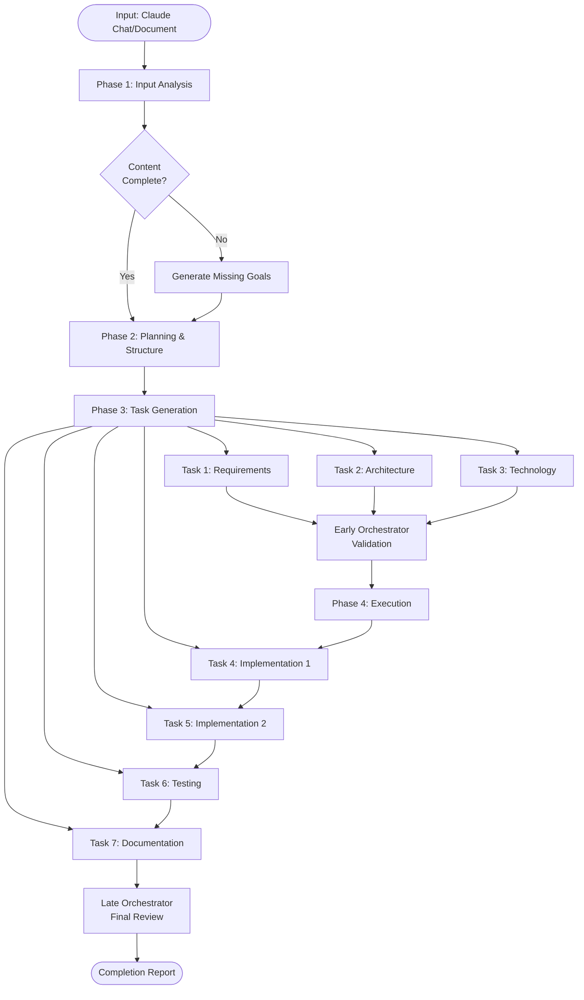
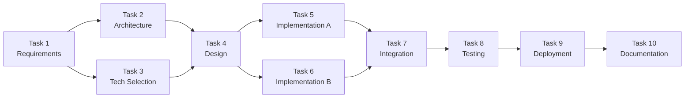
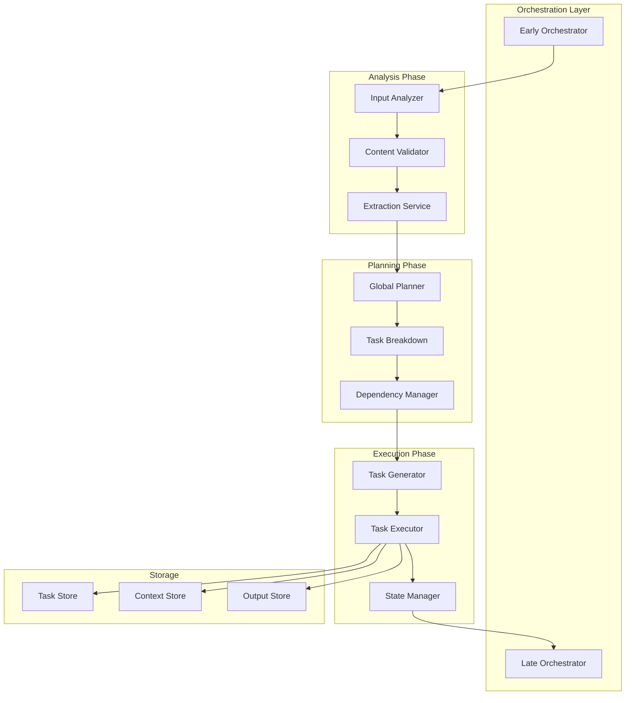
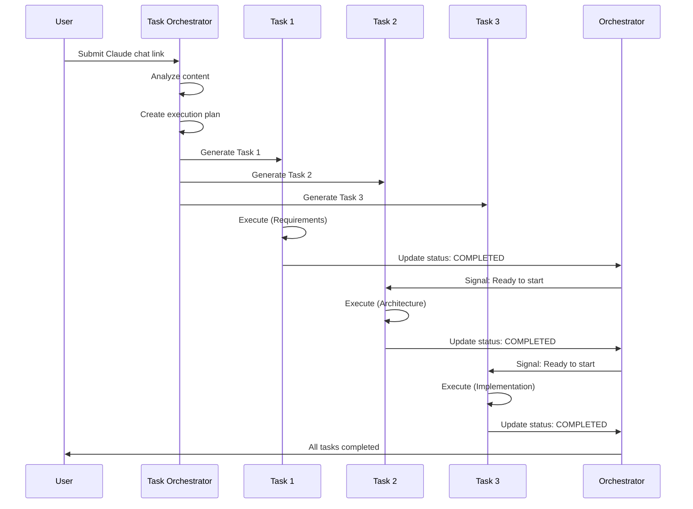
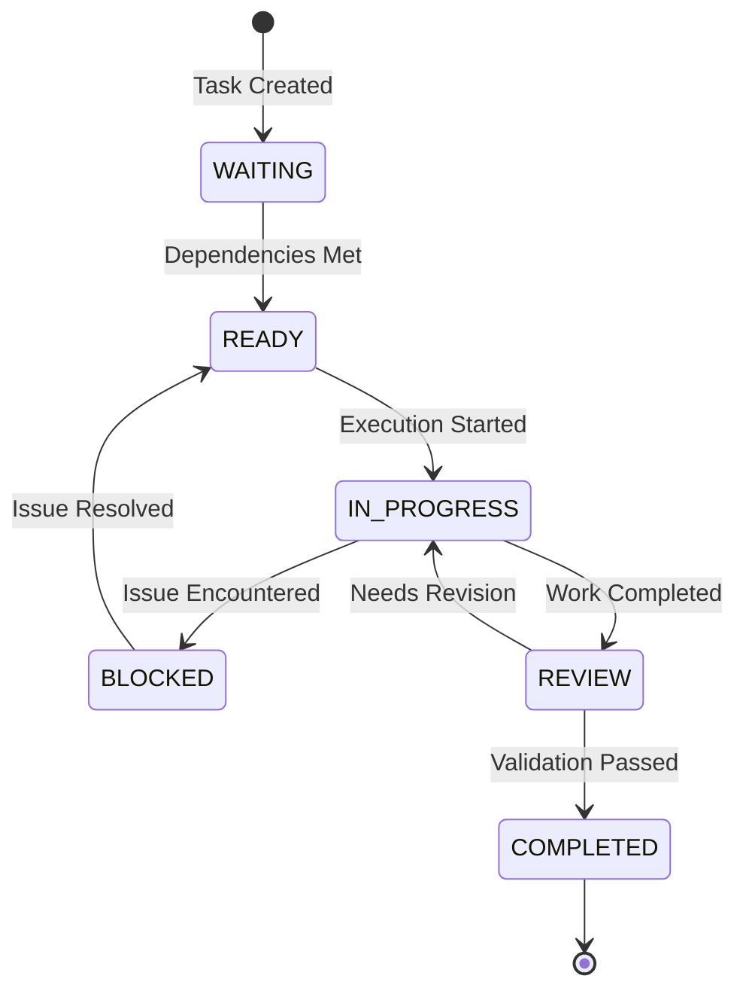

# Visual Workflow Schema Example

This document demonstrates the visual schemas that the Task Orchestrator & Analyzer agent generates.

## Task Chain Flowchart



## Task Dependency Graph



## Task Status Timeline

```mermaid
gantt
    title Task Execution Timeline
    dateFormat HH:mm
    section Phase 1
    Task 1 Requirements    :done, t1, 10:00, 2h
    Task 2 Architecture    :active, t2, after t1, 3h
    Task 3 Tech Selection  :t3, after t1, 2h
    section Phase 2
    Task 4 Design          :t4, after t2, 4h
    Task 5 Implementation A:t5, after t4, 6h
    Task 6 Implementation B:t6, after t4, 6h
    section Phase 3
    Task 7 Integration     :t7, after t5, 3h
    Task 8 Testing         :t8, after t7, 4h
    Task 9 Deployment      :t9, after t8, 2h
    Task 10 Documentation  :t10, after t9, 3h
```



## Component Relationship Diagram



## Task Chain Sequence



## Task State Machine



## Folder Structure Visualization

```
project-output/
│
├── 0-analysis/                    # Phase 1: Input Analysis
│   ├── content-summary.md         # ✓ What was provided
│   ├── objectives.md              # ✓ Identified goals
│   ├── initial-assessment.md      # ✓ First analysis
│   └── gaps-identified.md         # ✓ Missing information
│
├── 1-planning/                    # Phase 2: Planning
│   ├── global-plan.md             # ✓ Overall strategy
│   ├── task-breakdown.md          # ✓ Task decomposition
│   ├── dependencies-graph.md      # ✓ Task relationships
│   ├── resource-allocation.md     # ✓ Resource planning
│   └── risk-assessment.md         # ✓ Potential risks
│
├── 2-tasks/                       # Phase 3: Task Files
│   ├── task-001-requirements.md   # [COMPLETED]
│   ├── task-002-architecture.md   # [IN_PROGRESS]
│   ├── task-003-tech-selection.md # [READY]
│   ├── task-004-design.md         # [WAITING]
│   ├── task-005-implement-a.md    # [WAITING]
│   ├── task-006-implement-b.md    # [WAITING]
│   ├── task-007-integration.md    # [WAITING]
│   ├── task-008-testing.md        # [WAITING]
│   ├── task-009-deployment.md     # [WAITING]
│   └── task-010-documentation.md  # [WAITING]
│
├── 3-orchestration/               # Phase 4: Management
│   ├── early-orchestrator.md      # ✓ Initial validation
│   ├── monitoring-config.json     # ✓ Progress tracking
│   ├── sync-protocol.md           # ✓ Synchronization rules
│   ├── task-chain-status.json     # [LIVE] Status tracking
│   └── late-orchestrator.md       # ○ Final validation
│
├── 4-schemas/                     # Phase 5: Visualizations
│   ├── visual-workflow.md         # ✓ This file
│   ├── task-chain-diagram.md      # ✓ Sequence view
│   ├── component-relationships.md # ✓ Architecture view
│   └── execution-timeline.md      # ✓ Gantt chart
│
├── 5-outputs/                     # Phase 6: Results
│   ├── intermediate/              # Work in progress
│   ├── final/                     # Completed deliverables
│   └── artifacts/                 # Supporting files
│
└── shared-context/                # Shared Resources
    ├── project-overview.md        # ✓ High-level context
    ├── terminology.md             # ✓ Definitions
    ├── constraints.md             # ✓ Limitations
    └── references.md              # ✓ External links
```

## Task Progress Dashboard (ASCII)

```
╔════════════════════════════════════════════════════════════════╗
║                  TASK CHAIN EXECUTION STATUS                   ║
╠════════════════════════════════════════════════════════════════╣
║                                                                ║
║  Phase 1: Analysis & Planning                     [████████] 100%  ║
║    ├─ Task 1: Requirements Analysis               [COMPLETED] ║
║    ├─ Task 2: Architecture Design                 [COMPLETED] ║
║    └─ Task 3: Technology Selection                [COMPLETED] ║
║                                                                ║
║  Phase 2: Implementation                          [████░░░░]  50%  ║
║    ├─ Task 4: Core Implementation A               [COMPLETED] ║
║    ├─ Task 5: Core Implementation B               [IN_PROGRESS]  ║
║    └─ Task 6: Feature Implementation              [WAITING]   ║
║                                                                ║
║  Phase 3: Testing & Deployment                    [░░░░░░░░]   0%  ║
║    ├─ Task 7: Unit Testing                        [WAITING]   ║
║    ├─ Task 8: Integration Testing                 [WAITING]   ║
║    └─ Task 9: Deployment                          [WAITING]   ║
║                                                                ║
║  Phase 4: Finalization                            [░░░░░░░░]   0%  ║
║    └─ Task 10: Documentation                      [WAITING]   ║
║                                                                ║
╠════════════════════════════════════════════════════════════════╣
║  Overall Progress: ████████░░░░░░░░ 45% (5/10 tasks complete) ║
║  Estimated Completion: 2026-01-05 15:00                        ║
║  Time Elapsed: 6.5 hours | Remaining: 8.0 hours                ║
╚════════════════════════════════════════════════════════════════╝
```

## Task Communication Flow

```
┌─────────────────────────────────────────────────────────────────┐
│                    TASK COMMUNICATION FLOW                       │
└─────────────────────────────────────────────────────────────────┘

Input → [Analysis] → [Planning] → [Task Generation]
                                         ↓
                                   ┌─────────────┐
                                   │   Task 1    │
                                   │ (Generate   │
                                   │  Context)   │
                                   └──────┬──────┘
                                          │
                            ┌─────────────┼─────────────┐
                            ↓             ↓             ↓
                      ┌─────────┐   ┌─────────┐   ┌─────────┐
                      │ Task 2  │   │ Task 3  │   │ Task 4  │
                      │(Depends │   │(Depends │   │(Depends │
                      │  on T1) │   │  on T1) │   │  on T1) │
                      └────┬────┘   └────┬────┘   └────┬────┘
                           │             │             │
                           └─────────┬───┴─────────────┘
                                     ↓
                               ┌─────────┐
                               │ Task 5  │
                               │(Depends │
                               │on T2-T4)│
                               └────┬────┘
                                    ↓
                            [Orchestrator Review]
                                    ↓
                              [Completion]
```

## Legend

- **✓** = Completed
- **○** = Not Started
- **[COMPLETED]** = Task finished and validated
- **[IN_PROGRESS]** = Task currently being executed
- **[READY]** = Task ready to start (dependencies met)
- **[WAITING]** = Task waiting for dependencies
- **[BLOCKED]** = Task blocked by issue
- **[REVIEW]** = Task awaiting validation

## Notes

These visualizations are automatically generated by the Task Orchestrator & Analyzer agent based on the analyzed content and created task structure. They provide:

1. **Understanding**: Clear view of the entire workflow
2. **Tracking**: Real-time progress monitoring
3. **Communication**: Easy to share with stakeholders
4. **Planning**: Identify bottlenecks and optimize
5. **Documentation**: Permanent record of the process

All diagrams use standard formats (Mermaid, ASCII) that can be rendered in markdown viewers, GitHub, and documentation systems.
