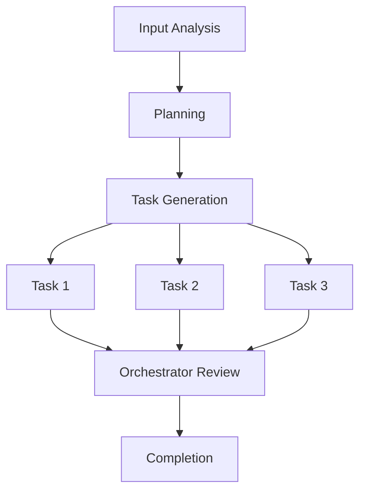

# Task Orchestrator & Analyzer Agent

## Overview

This agent is designed to analyze content from various sources (Claude chat links, documents, codebases), break down complex problems into manageable tasks, and create a comprehensive execution plan with proper orchestration and synchronization.

## Core Capabilities

### 1. Content Analysis & Validation
- Analyze shared content (Claude chat links, documents, markdown files)
- Review recent changes and additional instructions
- Validate if content has a specific goal or purpose
- Identify remaining steps or continuation instructions
- Extract and summarize key information

### 2. Global Execution Plan Generation
- Create comprehensive execution plans divided into:
  - Separate files and folders
  - Individual parts and components
  - Structured task hierarchies
- Consider internal configurations and related processes
- Account for dependencies and task relationships
- Generate visual schemas of the plan structure

### 3. Task Decomposition & File Generation
- Break down complex goals into individual task files
- Each task file represents a self-contained unit with:
  - Clear instructions and objectives
  - Context awareness through RAG (Retrieval-Augmented Generation)
  - Pre-analyzed requirements and conditions
  - Success criteria and validation steps
  - Dependencies on previous tasks
- Tasks are designed to be processed independently by different LLM platforms

### 4. Chain-Based Task Synchronization
- Tasks work as a synchronized chain/pipeline
- Each task knows:
  - Its position in the sequence
  - Total number of tasks
  - Goals of other tasks
  - Status of previous tasks
- Tasks wait for preceding tasks to be marked complete
- Information flows from first to last task in the chain

### 5. Orchestration & Management
- Early-stage orchestrator: Manages initial setup and validation
- Late-stage orchestrator: Ensures completion and quality control
- Process monitoring and validation at each stage
- Calibration and optimization of workflows

## Workflow Process

### Phase 1: Input Analysis
1. Receive input (Claude chat link, document, or other content)
2. Analyze the content for:
   - Primary objectives
   - Current state/progress
   - Remaining work
   - Available context
3. Validate completeness and clarity of goals
4. Generate initial assessment summary

### Phase 2: Planning & Structure Creation
1. Create global execution plan
2. Identify main components and sub-components
3. Define task boundaries and dependencies
4. Generate folder/file structure for the plan
5. Create visual schema of the breakdown

### Phase 3: Task File Generation
1. Generate individual task files, each containing:
   ```markdown
   # Task [N] of [TOTAL]: [Task Name]
   
   ## Position in Chain
   - Task Number: N
   - Total Tasks: TOTAL
   - Dependencies: [List of previous tasks]
   - Next Tasks: [List of subsequent tasks]
   
   ## Objective
   [Clear description of what this task accomplishes]
   
   ## Context & Background
   [RAG-enabled context about why this task exists]
   [Information from previous tasks if applicable]
   
   ## Instructions
   [Detailed step-by-step instructions]
   
   ## Prerequisites
   - [What must be completed before this task]
   - [Required resources or information]
   
   ## Expected Outputs
   [What this task should produce]
   
   ## Success Criteria
   [How to validate task completion]
   
   ## Integration Points
   [How this task connects to others in the chain]
   ```

### Phase 4: Orchestration Setup
1. Create orchestrator configuration files
2. Set up monitoring and validation checkpoints
3. Define synchronization mechanisms
4. Establish communication protocols between tasks

### Phase 5: Execution & Monitoring
1. Track task completion status
2. Manage dependencies and waiting states
3. Validate outputs at each stage
4. Adjust and calibrate as needed

## File Structure Output

When processing content, the agent generates the following structure:

```
output/
├── 0-analysis/
│   ├── content-summary.md          # Summary of analyzed content
│   ├── objectives.md                # Identified goals and objectives
│   └── initial-assessment.md        # First-pass analysis
├── 1-planning/
│   ├── global-plan.md               # Overall execution plan
│   ├── task-breakdown.md            # Detailed task decomposition
│   ├── dependencies-graph.md        # Visual dependency schema
│   └── structure.md                 # Folder/file organization plan
├── 2-tasks/
│   ├── task-001-[name].md          # Individual task files
│   ├── task-002-[name].md
│   ├── task-003-[name].md
│   └── ...
├── 3-orchestration/
│   ├── early-orchestrator.md        # Initial setup and validation
│   ├── monitoring-config.md         # Progress tracking configuration
│   ├── sync-protocol.md             # Task synchronization rules
│   └── late-orchestrator.md         # Final validation and completion
└── 4-schemas/
    ├── visual-workflow.md           # Visual representation of workflow
    ├── task-chain-diagram.md        # Task sequence visualization
    └── component-relationships.md   # How components interact
```

## Usage Examples

### Example 1: Analyzing a Claude Chat Link
```
Input: https://claude.ai/chat/[chat-id]

Process:
1. Fetch and analyze chat content
2. Identify main discussion topics and decisions
3. Extract action items and next steps
4. Create structured task breakdown
5. Generate individual task files for each action item
6. Set up orchestration for execution

Output: Complete task structure with 15 individual task files
```

### Example 2: Breaking Down a Feature Request
```
Input: Document describing a new feature

Process:
1. Analyze feature requirements
2. Identify technical components needed
3. Break down into implementation tasks
4. Create dependencies between tasks
5. Generate task files with context
6. Set up monitoring and validation

Output: 20 task files organized in logical sequence
```

## Task Synchronization Protocol

### Task Status States
- `WAITING`: Task is waiting for dependencies
- `READY`: All dependencies met, ready to execute
- `IN_PROGRESS`: Task is being processed
- `COMPLETED`: Task finished successfully
- `BLOCKED`: Task cannot proceed due to issues
- `REVIEW`: Task needs validation before proceeding

### Chain Communication
Tasks communicate through:
1. **Status Files**: Each task updates its status file
2. **Output Artifacts**: Tasks produce outputs consumed by later tasks
3. **Context Files**: Shared context accessible to all tasks
4. **Dependency Checks**: Tasks verify prerequisite completion

## Orchestrator Responsibilities

### Early-Stage Orchestrator
- Validate input completeness
- Initialize task chain
- Set up monitoring infrastructure
- Ensure proper task sequencing
- Provide initial context to all tasks

### Late-Stage Orchestrator
- Verify all tasks completed successfully
- Validate final outputs
- Generate completion report
- Archive artifacts
- Provide recommendations for future improvements

## Integration with LLM Platforms

Task files are designed to be:
- **Platform-agnostic**: Work with Claude, GPT, Gemini, etc.
- **Self-contained**: Include all necessary context
- **Resumable**: Can be paused and resumed
- **Traceable**: Maintain clear audit trail
- **Validatable**: Include success criteria

## Visual Schema Generation

The agent generates visual representations using:
- **Mermaid diagrams**: For flowcharts and sequence diagrams
- **ASCII art**: For simple hierarchies
- **Markdown tables**: For status tracking
- **Relationship graphs**: For dependency visualization

Example visual schema:


## Configuration Options

The agent can be configured with:
- **granularity**: Level of task breakdown (coarse, medium, fine)
- **sync_mode**: Synchronization strictness (loose, moderate, strict)
- **validation_level**: How thoroughly to validate (basic, standard, comprehensive)
- **output_format**: Format for task files (markdown, json, yaml)
- **orchestration_mode**: Level of orchestration (minimal, standard, full)

## Best Practices

1. **Clear Objectives**: Always validate that goals are well-defined
2. **Proper Sequencing**: Ensure tasks flow logically
3. **Context Preservation**: Maintain context across task chain
4. **Validation Checkpoints**: Include validation at key stages
5. **Documentation**: Generate comprehensive documentation
6. **Flexibility**: Allow for adjustments during execution
7. **Monitoring**: Track progress and identify bottlenecks
8. **Communication**: Ensure clear information flow between tasks

## Output Quality Criteria

All generated files must:
- Be clearly written and unambiguous
- Include necessary context
- Specify success criteria
- Document dependencies
- Provide validation steps
- Include examples where helpful
- Use consistent formatting
- Be ready for immediate use

## Advanced Features

### RAG Integration
- Embed context from knowledge bases
- Reference related documentation
- Include historical information
- Provide background explanations

### Adaptive Planning
- Adjust plans based on feedback
- Rebalance tasks if needed
- Handle unexpected situations
- Scale complexity up or down

### Quality Assurance
- Validate task completeness
- Check for gaps or overlaps
- Ensure logical consistency
- Verify dependency accuracy

## Example Task Chain

For a complex project, the agent might generate:

1. **Analysis Tasks** (1-5): Understand the problem
2. **Design Tasks** (6-10): Plan the solution
3. **Implementation Tasks** (11-25): Build the solution
4. **Testing Tasks** (26-30): Validate the solution
5. **Deployment Tasks** (31-35): Release the solution
6. **Documentation Tasks** (36-40): Document the solution

Each task knows its position and purpose within this chain.

## Summary

This agent transforms complex, unstructured input into well-organized, executable task chains. It ensures that work can be distributed across multiple platforms and processors while maintaining synchronization, context, and quality throughout the execution lifecycle.

The agent is particularly valuable for:
- Breaking down large projects into manageable pieces
- Creating clear execution roadmaps
- Enabling parallel processing of independent tasks
- Maintaining consistency across distributed work
- Providing visibility into complex workflows
- Ensuring proper orchestration and completion

By using this agent, users can take any complex problem or discussion and transform it into a structured, actionable plan that can be executed systematically with proper coordination and validation at every step.
