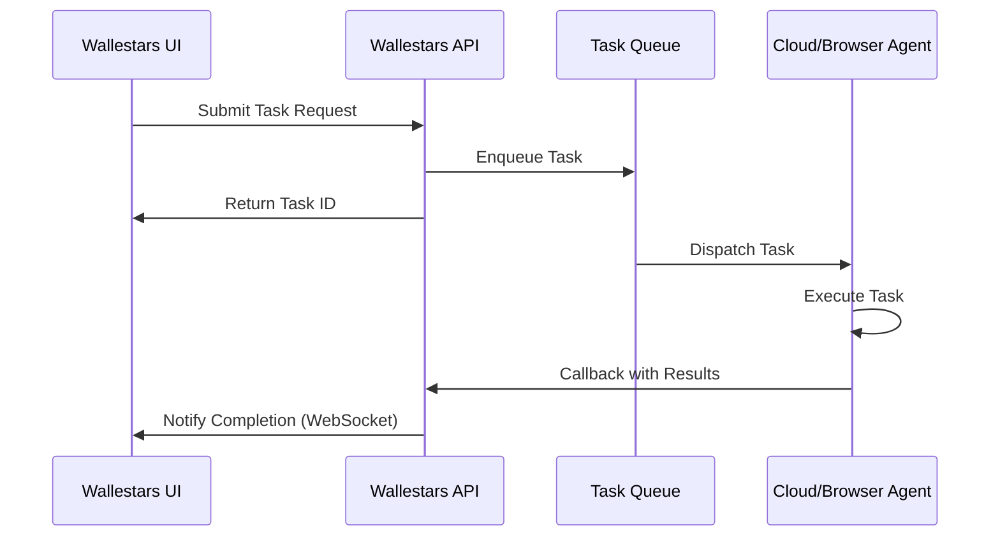

# 🤖 Agent Integration Plan

## Overview

This document outlines the plan for integrating cloud-based and browser-based agents into the Wallestars Control Center workflow system. These agents will execute tasks asynchronously and callback with results.

---

## 🎯 Objectives

1. **Enable Cloud Agent Integration** - Allow remote agents to execute tasks in cloud environments
2. **Browser Agent Support** - Enable headless browser automation for web-based tasks
3. **Callback Mechanism** - Implement reliable callback system for async task results
4. **Workflow Orchestration** - Coordinate multiple agents working on different tasks
5. **Status Monitoring** - Track agent health, task progress, and execution status

---

## 🏗️ Architecture

### Agent Types

#### 1. Cloud Agents
**Purpose**: Execute tasks in cloud environments (AWS Lambda, Azure Functions, GCP Cloud Functions)

**Capabilities**:
- API testing and validation
- Database operations
- File processing and transformation
- Integration testing
- Scheduled tasks and cron jobs

**Implementation**:
```javascript
// Cloud Agent Example Structure
{
  "agentType": "cloud",
  "provider": "aws-lambda" | "azure-functions" | "gcp-functions",
  "region": "us-east-1",
  "runtime": "nodejs20.x",
  "callbackUrl": "https://wallestars.example.com/api/agent-callback",
  "authentication": {
    "type": "bearer" | "api-key" | "oauth2",
    "credentials": "encrypted"
  }
}
```

#### 2. Browser Agents
**Purpose**: Execute browser automation tasks using headless browsers

**Capabilities**:
- End-to-end testing (Playwright/Cypress)
- Web scraping and data extraction
- Screenshot capture and visual regression
- Performance monitoring (Lighthouse)
- Accessibility testing

**Implementation**:
```javascript
// Browser Agent Example Structure
{
  "agentType": "browser",
  "engine": "playwright" | "puppeteer" | "selenium",
  "browser": "chromium" | "firefox" | "webkit",
  "viewport": { "width": 1920, "height": 1080 },
  "callbackUrl": "https://wallestars.example.com/api/agent-callback",
  "options": {
    "headless": true,
    "timeout": 30000,
    "screenshots": true
  }
}
```

#### 3. Hybrid Agents
**Purpose**: Combine local and remote execution for complex workflows

**Use Cases**:
- Multi-step deployments
- Cross-platform testing
- Data pipeline orchestration

---

## 📋 Task Execution Flow

### 1. Task Submission



### 2. Callback Mechanism

**Callback Endpoint**: `POST /api/agent-callback`

**Request Payload**:
```json
{
  "taskId": "uuid-v4-task-identifier",
  "agentId": "agent-unique-identifier",
  "status": "success" | "failure" | "partial",
  "timestamp": "2026-01-13T17:00:00.000Z",
  "duration": 12345,
  "results": {
    "data": {},
    "artifacts": [],
    "logs": [],
    "metrics": {}
  },
  "error": {
    "code": "ERROR_CODE",
    "message": "Error description",
    "stack": "Stack trace if available"
  }
}
```

**Response**:
```json
{
  "acknowledged": true,
  "nextAction": "none" | "retry" | "escalate",
  "metadata": {}
}
```

### 3. Status Monitoring

**Real-time Updates via WebSocket**:
```javascript
socket.on('agent:status', (data) => {
  // data.taskId
  // data.status: 'queued' | 'running' | 'completed' | 'failed'
  // data.progress: 0-100
  // data.message: Status message
});
```

---

## 🔧 Implementation Plan

### Phase 1: Core Infrastructure (Week 1-2)

#### Backend API Extensions

**1. Task Queue System**
```javascript
// server/queue/taskQueue.js
export class TaskQueue {
  async enqueue(task) {
    // Add task to queue (Redis/RabbitMQ)
    // Return task ID
  }
  
  async dispatch(taskId, agentType) {
    // Send task to appropriate agent
    // Track dispatch status
  }
  
  async getStatus(taskId) {
    // Retrieve current task status
  }
}
```

**2. Callback Handler**
```javascript
// server/routes/agentCallback.js
router.post('/api/agent-callback', async (req, res) => {
  try {
    const { taskId, status, results, error } = req.body;
    
    // Validate callback signature
    await validateCallbackAuth(req);
    
    // Update task status
    await taskQueue.updateStatus(taskId, status, results);
    
    // Notify via WebSocket
    io.emit(`task:${taskId}:complete`, { status, results });
    
    // Store results
    await storage.saveTaskResults(taskId, results);
    
    res.json({ acknowledged: true });
  } catch (err) {
    res.status(500).json({ error: err.message });
  }
});
```

**3. Agent Registry**
```javascript
// server/agents/registry.js
export class AgentRegistry {
  async register(agent) {
    // Register new agent
    // Health check
    // Store capabilities
  }
  
  async getAvailableAgent(requirements) {
    // Find suitable agent based on requirements
    // Load balancing
  }
  
  async healthCheck(agentId) {
    // Check agent health
    // Update status
  }
}
```

#### Database Schema

```sql
-- Tasks table
CREATE TABLE tasks (
  id UUID PRIMARY KEY,
  type VARCHAR(50) NOT NULL,
  agent_type VARCHAR(50) NOT NULL,
  status VARCHAR(20) DEFAULT 'queued',
  priority INTEGER DEFAULT 5,
  payload JSONB NOT NULL,
  results JSONB,
  error JSONB,
  created_at TIMESTAMP DEFAULT NOW(),
  started_at TIMESTAMP,
  completed_at TIMESTAMP,
  timeout INTEGER DEFAULT 300000
);

-- Agents table
CREATE TABLE agents (
  id UUID PRIMARY KEY,
  name VARCHAR(100) NOT NULL,
  type VARCHAR(50) NOT NULL,
  status VARCHAR(20) DEFAULT 'active',
  capabilities JSONB NOT NULL,
  endpoint VARCHAR(255) NOT NULL,
  last_heartbeat TIMESTAMP,
  created_at TIMESTAMP DEFAULT NOW()
);

-- Task history/logs
CREATE TABLE task_logs (
  id SERIAL PRIMARY KEY,
  task_id UUID REFERENCES tasks(id),
  timestamp TIMESTAMP DEFAULT NOW(),
  level VARCHAR(20),
  message TEXT,
  metadata JSONB
);
```

### Phase 2: Cloud Agent Integration (Week 3-4)

#### AWS Lambda Integration

**1. Lambda Function Template**
```javascript
// agents/cloud/aws-lambda/handler.js
export const handler = async (event) => {
  const { taskId, payload, callbackUrl } = JSON.parse(event.body);
  
  try {
    // Execute task
    const results = await executeTask(payload);
    
    // Callback to Wallestars
    await fetch(callbackUrl, {
      method: 'POST',
      headers: {
        'Content-Type': 'application/json',
        'Authorization': `Bearer ${process.env.CALLBACK_TOKEN}`
      },
      body: JSON.stringify({
        taskId,
        status: 'success',
        results
      })
    });
    
    return { statusCode: 200, body: 'Task completed' };
  } catch (error) {
    // Error callback
    await fetch(callbackUrl, {
      method: 'POST',
      body: JSON.stringify({
        taskId,
        status: 'failure',
        error: { message: error.message, stack: error.stack }
      })
    });
    
    throw error;
  }
};
```

**2. Deployment Script**
```bash
#!/bin/bash
# agents/cloud/aws-lambda/deploy.sh

# Package function
zip -r function.zip handler.js node_modules/

# Deploy to AWS Lambda
aws lambda create-function \
  --function-name wallestars-agent \
  --runtime nodejs20.x \
  --role arn:aws:iam::ACCOUNT:role/lambda-role \
  --handler handler.handler \
  --zip-file fileb://function.zip \
  --environment Variables="{CALLBACK_TOKEN=$CALLBACK_TOKEN}"
```

#### Azure Functions Integration

**1. Function Template**
```javascript
// agents/cloud/azure-functions/index.js
module.exports = async function (context, req) {
  const { taskId, payload, callbackUrl } = req.body;
  
  try {
    const results = await executeTask(payload);
    
    await callbackToWallestars(callbackUrl, {
      taskId,
      status: 'success',
      results
    });
    
    context.res = { status: 200, body: 'Task completed' };
  } catch (error) {
    await callbackToWallestars(callbackUrl, {
      taskId,
      status: 'failure',
      error: { message: error.message }
    });
    
    context.res = { status: 500, body: error.message };
  }
};
```

### Phase 3: Browser Agent Integration (Week 5-6)

#### Playwright Agent

**1. Agent Service**
```javascript
// agents/browser/playwright/agent.js
import { chromium } from 'playwright';

export class PlaywrightAgent {
  async executeTask(task) {
    const browser = await chromium.launch({
      headless: true,
      args: ['--no-sandbox']
    });
    
    try {
      const context = await browser.newContext({
        viewport: task.viewport || { width: 1920, height: 1080 }
      });
      
      const page = await context.newPage();
      
      // Execute task based on type
      switch (task.type) {
        case 'screenshot':
          return await this.captureScreenshot(page, task.payload);
        case 'e2e-test':
          return await this.runE2ETest(page, task.payload);
        case 'scrape':
          return await this.scrapeData(page, task.payload);
        default:
          throw new Error(`Unknown task type: ${task.type}`);
      }
    } finally {
      await browser.close();
    }
  }
  
  async captureScreenshot(page, { url, selector }) {
    await page.goto(url);
    if (selector) {
      await page.waitForSelector(selector);
    }
    const screenshot = await page.screenshot({ fullPage: true });
    return { screenshot: screenshot.toString('base64') };
  }
  
  async runE2ETest(page, { url, steps }) {
    await page.goto(url);
    const results = [];
    
    for (const step of steps) {
      try {
        await this.executeStep(page, step);
        results.push({ step, status: 'passed' });
      } catch (error) {
        results.push({ step, status: 'failed', error: error.message });
      }
    }
    
    return { results };
  }
}
```

**2. Agent Server**
```javascript
// agents/browser/playwright/server.js
import express from 'express';
import { PlaywrightAgent } from './agent.js';

const app = express();
const agent = new PlaywrightAgent();

app.post('/execute', async (req, res) => {
  const { taskId, payload, callbackUrl } = req.body;
  
  // Execute asynchronously
  setImmediate(async () => {
    try {
      const results = await agent.executeTask(payload);
      
      await fetch(callbackUrl, {
        method: 'POST',
        headers: { 'Content-Type': 'application/json' },
        body: JSON.stringify({ taskId, status: 'success', results })
      });
    } catch (error) {
      await fetch(callbackUrl, {
        method: 'POST',
        body: JSON.stringify({
          taskId,
          status: 'failure',
          error: { message: error.message }
        })
      });
    }
  });
  
  res.json({ accepted: true, taskId });
});

app.listen(3001, () => {
  console.log('Playwright agent listening on port 3001');
});
```

### Phase 4: Frontend Integration (Week 7)

#### Task Management UI

**1. Agent Dashboard Component**
```jsx
// src/pages/AgentDashboard.jsx
import { useState, useEffect } from 'react';
import { useSocket } from '../context/SocketContext';

export default function AgentDashboard() {
  const [agents, setAgents] = useState([]);
  const [tasks, setTasks] = useState([]);
  const socket = useSocket();
  
  useEffect(() => {
    loadAgents();
    loadTasks();
    
    socket.on('agent:status', handleAgentStatus);
    socket.on('task:update', handleTaskUpdate);
    
    return () => {
      socket.off('agent:status');
      socket.off('task:update');
    };
  }, []);
  
  const submitTask = async (taskData) => {
    const response = await fetch('/api/tasks', {
      method: 'POST',
      headers: { 'Content-Type': 'application/json' },
      body: JSON.stringify(taskData)
    });
    
    const { taskId } = await response.json();
    return taskId;
  };
  
  return (
    <div className="agent-dashboard">
      <h1>Agent Management</h1>
      
      <section className="agents">
        <h2>Active Agents</h2>
        {agents.map(agent => (
          <AgentCard key={agent.id} agent={agent} />
        ))}
      </section>
      
      <section className="tasks">
        <h2>Task Queue</h2>
        <TaskSubmissionForm onSubmit={submitTask} />
        <TaskList tasks={tasks} />
      </section>
    </div>
  );
}
```

**2. Task Status Component**
```jsx
// src/components/TaskStatus.jsx
export function TaskStatus({ task }) {
  const getStatusColor = (status) => {
    switch (status) {
      case 'queued': return 'text-yellow-500';
      case 'running': return 'text-blue-500';
      case 'completed': return 'text-green-500';
      case 'failed': return 'text-red-500';
      default: return 'text-gray-500';
    }
  };
  
  return (
    <div className="task-status">
      <div className="flex items-center gap-2">
        <span className={getStatusColor(task.status)}>
          {task.status.toUpperCase()}
        </span>
        {task.status === 'running' && (
          <div className="progress-bar">
            <div 
              className="progress" 
              style={{ width: `${task.progress}%` }}
            />
          </div>
        )}
      </div>
      
      {task.results && (
        <div className="results">
          <pre>{JSON.stringify(task.results, null, 2)}</pre>
        </div>
      )}
    </div>
  );
}
```

---

## 🔐 Security Considerations

### Authentication

1. **Agent Registration**
   - API key generation for each agent
   - Mutual TLS for agent-to-server communication
   - Token rotation policy

2. **Callback Validation**
   - HMAC signature verification
   - Timestamp validation (prevent replay attacks)
   - IP whitelist for known agents

3. **Task Payload Security**
   - Input sanitization
   - Payload encryption for sensitive data
   - Size limits to prevent DoS

### Implementation Example

```javascript
// server/middleware/agentAuth.js
export function validateAgentCallback(req, res, next) {
  const signature = req.headers['x-agent-signature'];
  const timestamp = req.headers['x-agent-timestamp'];
  const agentId = req.headers['x-agent-id'];
  
  // Verify timestamp (5 minute window)
  const now = Date.now();
  const requestTime = parseInt(timestamp);
  if (Math.abs(now - requestTime) > 300000) {
    return res.status(401).json({ error: 'Request expired' });
  }
  
  // Verify HMAC signature
  const secret = await getAgentSecret(agentId);
  const payload = JSON.stringify(req.body);
  const expectedSignature = crypto
    .createHmac('sha256', secret)
    .update(timestamp + payload)
    .digest('hex');
  
  if (signature !== expectedSignature) {
    return res.status(401).json({ error: 'Invalid signature' });
  }
  
  next();
}
```

---

## 📊 Monitoring & Observability

### Metrics to Track

1. **Agent Health**
   - Uptime percentage
   - Average response time
   - Success rate
   - Error rate

2. **Task Performance**
   - Queue depth
   - Average execution time
   - Completion rate
   - Retry rate

3. **System Health**
   - Callback latency
   - WebSocket connection count
   - Database query performance

### Implementation

```javascript
// server/monitoring/metrics.js
export class MetricsCollector {
  async recordTaskExecution(taskId, duration, status) {
    await prometheus.histogram('task_duration_seconds', duration);
    await prometheus.counter('task_completions_total', { status });
  }
  
  async recordAgentHealth(agentId, isHealthy) {
    await prometheus.gauge('agent_health', isHealthy ? 1 : 0, { agentId });
  }
  
  async recordQueueDepth(depth) {
    await prometheus.gauge('task_queue_depth', depth);
  }
}
```

---

## 🧪 Testing Strategy

### Unit Tests
```javascript
// tests/agents/taskQueue.test.js
describe('TaskQueue', () => {
  it('should enqueue task successfully', async () => {
    const queue = new TaskQueue();
    const taskId = await queue.enqueue({
      type: 'screenshot',
      payload: { url: 'https://example.com' }
    });
    expect(taskId).toBeDefined();
  });
  
  it('should dispatch task to available agent', async () => {
    const queue = new TaskQueue();
    const agent = await registry.getAvailableAgent({ type: 'browser' });
    await queue.dispatch(taskId, agent.id);
    // Verify dispatch
  });
});
```

### Integration Tests
```javascript
// tests/integration/agentCallback.test.js
describe('Agent Callback Integration', () => {
  it('should process callback and update task status', async () => {
    const taskId = await createTestTask();
    
    const response = await fetch('/api/agent-callback', {
      method: 'POST',
      body: JSON.stringify({
        taskId,
        status: 'success',
        results: { data: 'test' }
      })
    });
    
    expect(response.status).toBe(200);
    
    const task = await getTask(taskId);
    expect(task.status).toBe('success');
  });
});
```

### E2E Tests
```javascript
// tests/e2e/agentWorkflow.test.js
describe('End-to-End Agent Workflow', () => {
  it('should submit task, execute, and receive callback', async () => {
    // Submit task via UI
    const taskId = await submitTaskViaUI({
      type: 'screenshot',
      url: 'https://example.com'
    });
    
    // Wait for agent to execute
    await waitForTaskCompletion(taskId, 30000);
    
    // Verify results displayed in UI
    const results = await getTaskResults(taskId);
    expect(results.screenshot).toBeDefined();
  });
});
```

---

## 📝 Configuration Files

### Agent Configuration Template

**`config/agents.json`**
```json
{
  "agents": [
    {
      "id": "cloud-agent-1",
      "type": "cloud",
      "provider": "aws-lambda",
      "endpoint": "https://lambda.us-east-1.amazonaws.com/function/wallestars-agent",
      "capabilities": ["api-testing", "file-processing"],
      "concurrency": 10,
      "timeout": 300000,
      "authentication": {
        "type": "api-key",
        "keyName": "AWS_LAMBDA_API_KEY"
      }
    },
    {
      "id": "browser-agent-1",
      "type": "browser",
      "engine": "playwright",
      "endpoint": "http://localhost:3001",
      "capabilities": ["screenshot", "e2e-test", "scraping"],
      "concurrency": 5,
      "timeout": 60000,
      "authentication": {
        "type": "bearer",
        "keyName": "BROWSER_AGENT_TOKEN"
      }
    }
  ],
  "queue": {
    "type": "redis",
    "host": "localhost",
    "port": 6379,
    "maxRetries": 3,
    "retryDelay": 5000
  },
  "callbacks": {
    "url": "https://wallestars.example.com/api/agent-callback",
    "authentication": {
      "type": "hmac-sha256",
      "secretKey": "CALLBACK_SECRET"
    },
    "timeout": 10000
  }
}
```

---

## 🚀 Deployment Guide

### Docker Compose Setup

**`docker-compose.agents.yml`**
```yaml
version: '3.8'

services:
  redis:
    image: redis:7-alpine
    ports:
      - "6379:6379"
    volumes:
      - redis-data:/data

  playwright-agent:
    build: ./agents/browser/playwright
    ports:
      - "3001:3001"
    environment:
      - CALLBACK_URL=http://wallestars:3000/api/agent-callback
      - CALLBACK_TOKEN=${CALLBACK_TOKEN}
    depends_on:
      - wallestars

  wallestars:
    build: .
    ports:
      - "3000:3000"
      - "5173:5173"
    environment:
      - ANTHROPIC_API_KEY=${ANTHROPIC_API_KEY}
      - REDIS_URL=redis://redis:6379
    depends_on:
      - redis

volumes:
  redis-data:
```

### Kubernetes Deployment

**`k8s/agents-deployment.yaml`**
```yaml
apiVersion: apps/v1
kind: Deployment
metadata:
  name: playwright-agent
spec:
  replicas: 3
  selector:
    matchLabels:
      app: playwright-agent
  template:
    metadata:
      labels:
        app: playwright-agent
    spec:
      containers:
      - name: agent
        image: wallestars/playwright-agent:latest
        ports:
        - containerPort: 3001
        env:
        - name: CALLBACK_URL
          valueFrom:
            configMapKeyRef:
              name: agent-config
              key: callback-url
        - name: CALLBACK_TOKEN
          valueFrom:
            secretKeyRef:
              name: agent-secrets
              key: callback-token
        resources:
          requests:
            memory: "512Mi"
            cpu: "500m"
          limits:
            memory: "1Gi"
            cpu: "1000m"
```

---

## 📅 Timeline

| Phase | Duration | Deliverables |
|-------|----------|--------------|
| Phase 1: Core Infrastructure | 2 weeks | Task queue, callback handler, agent registry, database schema |
| Phase 2: Cloud Agents | 2 weeks | AWS Lambda & Azure Functions integration, deployment scripts |
| Phase 3: Browser Agents | 2 weeks | Playwright/Puppeteer agents, automation capabilities |
| Phase 4: Frontend | 1 week | Agent dashboard, task management UI, real-time updates |
| Phase 5: Testing & Docs | 1 week | Unit/integration/e2e tests, documentation, examples |
| **Total** | **8 weeks** | Complete agent integration system |

---

## 🎯 Success Metrics

1. **Agent Availability**: > 99% uptime for registered agents
2. **Task Success Rate**: > 95% successful task completions
3. **Callback Latency**: < 100ms average callback processing time
4. **Queue Throughput**: > 100 tasks/minute processing capacity
5. **Error Recovery**: < 1% of tasks fail permanently (after retries)

---

## 📚 References

- [GitHub Actions Documentation](https://docs.github.com/en/actions)
- [AWS Lambda Guide](https://docs.aws.amazon.com/lambda/)
- [Azure Functions Documentation](https://docs.microsoft.com/azure/azure-functions/)
- [Playwright Documentation](https://playwright.dev/)
- [Redis Queue Patterns](https://redis.io/topics/streams-intro)
- [WebSocket Best Practices](https://socket.io/docs/v4/)
- [HMAC Authentication](https://tools.ietf.org/html/rfc2104)

---

**Last Updated**: January 13, 2026  
**Status**: Planning Phase  
**Owner**: Wallestars Development Team
