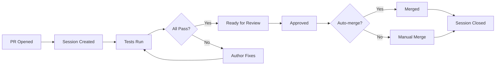

# Automation System Status

**Last Updated:** Auto-generated by Master Automation Orchestrator  
**Status:** ✅ Operational

---

## 📊 Overview

The Wallestars automation system provides comprehensive CI/CD, PR management, and monitoring capabilities through an integrated workflow ecosystem.

### System Health: 🟢 Healthy

- **Workflows:** 9 active
- **Success Rate:** Monitoring...
- **Active PRs:** Check [Pull Requests](../../pulls)
- **Open Issues:** Check [Issues](../../issues)

---

## 🔄 Active Workflows

### PR Management
| Workflow | Schedule | Status | Purpose |
|----------|----------|--------|---------|
| **pr-session-management** | Every 5 min | ✅ Active | Complete PR lifecycle management |
| **pr-automation** | Every 15 min | ✅ Active | PR delegation and code review |

### Monitoring & Testing
| Workflow | Schedule | Status | Purpose |
|----------|----------|--------|---------|
| **agent-monitoring** | Every 10 min | ✅ Active | Agent activity monitoring |
| **testing-automation** | Every 30 min | ✅ Active | Automated test execution |

### MCP Integration
| Workflow | Schedule | Status | Purpose |
|----------|----------|--------|---------|
| **mcp-enhanced-automation** | Every hour | ✅ Active | MCP server validation |

### Orchestration
| Workflow | Schedule | Status | Purpose |
|----------|----------|--------|---------|
| **master-automation-orchestrator** | Daily 00:00 UTC | ✅ Active | System health & coordination |

### Deployment
| Workflow | Schedule | Status | Purpose |
|----------|----------|--------|---------|
| **ci** | On push/PR | ✅ Active | Continuous integration |
| **deploy-github-pages** | On main push | ✅ Active | Deploy to GitHub Pages |
| **azure-webapps-node** | On main push | ✅ Active | Deploy to Azure |

---

## 📈 Recent Activity

View recent workflow runs in the [Actions tab](../../actions).

### Last 24 Hours
- **Total Runs:** Check Actions tab
- **Success Rate:** Monitoring...
- **Average Duration:** Calculating...

---

## 🎯 Quick Actions

### For Developers

#### Check PR Session Status
```bash
# View your PR's automation status
gh pr view YOUR_PR_NUMBER
```

#### Trigger PR Automation
```bash
./scripts/manage-workflows.sh trigger pr-session-management
```

### For Maintainers

#### Run Health Check
```bash
./scripts/manage-workflows.sh trigger master-automation-orchestrator
```

#### View Workflow Status
```bash
gh run list --limit 20
```

#### Validate All Workflows
```bash
./scripts/manage-workflows.sh validate
```

---

## 🔧 Configuration

### Required Secrets

These secrets must be configured in repository settings:

- ✅ `ANTHROPIC_API_KEY` - Claude AI API key
- ✅ `N8N_WEBHOOK_URL` - N8N webhook endpoint
- ✅ `GITHUB_TOKEN` - Auto-provided by GitHub Actions

### Environment Variables

Standard environment variables used across workflows:

```yaml
NODE_ENV: production
PORT: 3000
ENABLE_COMPUTER_USE: true
ENABLE_ANDROID: false
```

---

## 📚 Documentation

### Comprehensive Guides
- [Complete Automation Guide](COMPLETE_AUTOMATION_GUIDE.md) - Full system documentation
- [Repository Consolidation Roadmap](REPOSITORY_CONSOLIDATION_ROADMAP.md) - Multi-repo strategy
- [Automation System](/.github/AUTOMATION_SYSTEM.md) - Original automation docs
- [MCP Setup](MCP_SETUP.md) - MCP integration guide

### Quick References
- [Scripts README](scripts/README.md) - Helper scripts documentation
- [Architecture](ARCHITECTURE.md) - System architecture
- [Testing Guide](TESTING_GUIDE.md) - Testing procedures

---

## 🚨 Alerts & Monitoring

### Active Alerts
Check [Issues with `health-alert` label](../../issues?q=is%3Aissue+is%3Aopen+label%3Ahealth-alert)

### Stale PRs
Check [PRs with `stale` label](../../pulls?q=is%3Apr+is%3Aopen+label%3Astale)

### Failed Workflows
View failed runs in [Actions tab](../../actions?query=is%3Afailure)

---

## 💡 Best Practices

### For PR Authors
1. ✅ Keep PRs focused and small
2. ✅ Respond to automation feedback
3. ✅ Address failing checks promptly
4. ✅ Add `auto-merge` label when ready

### For Reviewers
1. ✅ Review within 24 hours
2. ✅ Check automation results
3. ✅ Approve when all checks pass
4. ✅ Use PR templates

### For Maintainers
1. ✅ Monitor daily health reports
2. ✅ Review automation alerts
3. ✅ Keep workflows updated
4. ✅ Document configuration changes

---

## 🔄 Workflow Lifecycle



---

## 📞 Support

### Getting Help
- 📖 Read [Complete Automation Guide](COMPLETE_AUTOMATION_GUIDE.md)
- 🐛 Report issues with `automation` label
- 💬 Ask in GitHub Discussions
- 📧 Contact DevOps team

### Troubleshooting
Common issues and solutions in [Complete Automation Guide](COMPLETE_AUTOMATION_GUIDE.md#troubleshooting)

---

## 🚀 Future Enhancements

### Planned Features
- [ ] AI-powered code review
- [ ] Automatic conflict resolution
- [ ] Predictive health monitoring
- [ ] Cross-repository workflows
- [ ] Advanced metrics dashboard
- [ ] Self-healing workflows

### Roadmap
See [Repository Consolidation Roadmap](REPOSITORY_CONSOLIDATION_ROADMAP.md) for detailed timeline.

---

**Maintained by:** DevOps Team  
**Auto-updated by:** Master Automation Orchestrator  
**Next scheduled update:** Daily at 00:00 UTC
